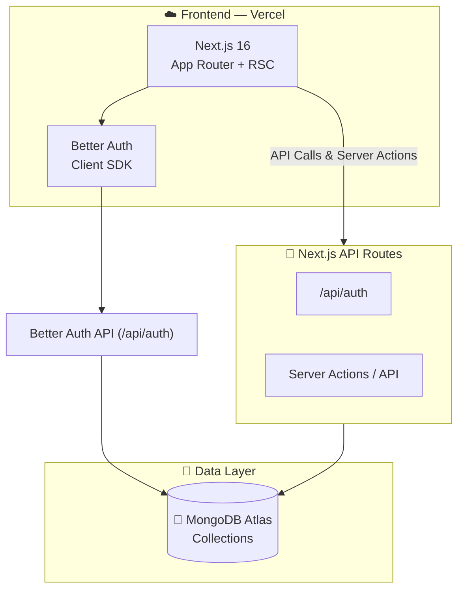

<div align="center">

# 🛒 SunCart

### Your Ultimate E-commerce Destination.

A **full-stack** e-commerce platform offering a seamless shopping experience. Features secure authentication, comprehensive product discovery, and a user-friendly profile dashboard.

&nbsp;

[](https://nextjs.org/)
[](https://react.dev/)
[](https://tailwindcss.com/)
[](https://www.mongodb.com/)
[](https://www.better-auth.com/)
[](https://heroui.com/)

&nbsp;

🌐 [**Live Website**](https://sun-cart-six.vercel.app/) &nbsp;·&nbsp; 🔌 [**Repository**](https://github.com/ashiqurrhmn/SunCart)

</div>

---

## 📖 Table of Contents

- [Overview](#-overview)
- [Why SunCart Stands Out](#-why-suncart-stands-out)
- [Tech Stack](#-tech-stack)
- [Key Features](#-key-features)
- [Architecture](#-architecture)
- [Getting Started](#-getting-started)
- [Environment Variables](#-environment-variables)
- [Deployment](#-deployment)
- [Author](#-author)

---

## 🎯 Overview

**SunCart** is a modern e-commerce marketplace built to provide users with a delightful shopping experience. Built with Next.js 16's App Router and React Server Components, and backed by MongoDB, it delivers blazing-fast performance, secure authentication, and a beautiful user interface.

---

## ✨ Why SunCart Stands Out

| | Feature | Description |
|---|---|---|
| 🔐 | **Better Auth Integration** | Seamless authentication with MongoDB adapter and JWT session management. |
| 🛍️ | **Product Discovery** | Browse popular products, top brands, and get personalized recommendations like "Summer Tips". |
| 👤 | **User Profiles** | Dedicated profile dashboards for users to manage their details and track their activities. |
| 🎨 | **Beautiful UI/UX** | Clean, modern design powered by Tailwind CSS v4, HeroUI, and engaging animations. |
| ⚡ | **React Compiler + RSC** | Next.js 16 with React 19, React Compiler enabled, and Server Components for optimal performance. |

---

## 🔧 Tech Stack

### Full-Stack

| Technology | Version | Purpose |
|---|---|---|
| **Next.js** | 16.x | App Router, React Server Components, API Routes |
| **React** | 19.x | UI library with concurrent features + React Compiler |
| **Tailwind CSS** | v4 | Utility-first responsive styling |
| **HeroUI** | 3.x | Accessible, beautiful component library |
| **Better Auth** | 1.6+ | Authentication with MongoDB adapter |
| **MongoDB** | 7.x | NoSQL database via native driver |
| **Animate.css** | 4.x | Ready-to-use animations |

---

## 🔑 Key Features

### 🔒 Authentication & Authorization
- Secure registration and sign-in via **Better Auth**.
- JWT-based session handling with MongoDB-backed persistence.
- Protected routes for user profiles and private dashboards.

### 🔍 Product Discovery & Browsing
- Explore the **All Products** catalog.
- Highlighted sections for **Popular Products** and **Top Brands**.
- Special **Summer Tips** and promotional banners.

### 📊 User Dashboard
- **Profile Management**: Manage your personal details and preferences securely.
- **Order Tracking** *(Coming Soon)*: Keep track of your purchases and shopping cart.

### 💅 UI/UX & Design
- Clean and welcoming interface designed to highlight products.
- Responsive design tailored for optimal viewing on mobile, tablet, and desktop.
- Interactive components like Modals, Toasts (`react-toastify`), and intuitive navigation.

---

## 🏗️ Architecture



### Database Collections

| Collection | Purpose |
|---|---|
| `user`, `session`, `account` | User authentication records and sessions (managed by Better Auth) |
| `products` | Product catalog with details, prices, and images *(Standard E-commerce model)* |

---

## 🚀 Getting Started

### Prerequisites

- **Node.js** v18+ (v22 recommended)
- **MongoDB** cluster ([MongoDB Atlas](https://www.mongodb.com/atlas) recommended)

### Installation

```bash
# ── 1. Clone the repository ──────────────────────────────

git clone https://github.com/ashiqurrhmn/SunCart.git
cd SunCart

# ── 2. Install dependencies ───────────────────────────────────

npm install

# ── 3. Configure Environment Variables ──────────────────────

# Create .env file (see Environment Variables section below)

# ── 4. Start the development server ─────────────────────────

npm run dev
# → Application runs on http://localhost:3000
```

---

## 🔐 Environment Variables

Create a `.env` file in the root directory:

```env
# MongoDB connection (used by Better Auth and data fetching)
MONGO_URI=mongodb+srv://<user>:<password>@<cluster>.mongodb.net
AUTH_DB_NAME=suncart

# Better Auth
BETTER_AUTH_SECRET=your-secret-key
BETTER_AUTH_URL=http://localhost:3000
NEXT_PUBLIC_BASE_URL=http://localhost:3000
```

---

## 🌐 Deployment

| Service | Purpose | Details |
|---|---|---|
| **Vercel** | Next.js Full-Stack App | Auto-deploy from GitHub, edge-optimized |
| **MongoDB Atlas** | Database | Cloud-hosted NoSQL with free tier |

---

## 👤 Author

<div align="center">

**Built with 🔥 by [Md. Ashiqur Rahman](https://ashiqur-portfolio0.vercel.app/)**

&nbsp;

[](https://ashiqur-portfolio0.vercel.app/)
[](https://github.com/ashiqurrhmn)
[](https://www.linkedin.com/in/ashiqur-rahman00/)
[](mailto:ashiqur1312@gmail.com)

</div>

---

<div align="center">

### ⭐ If you found this helpful, give it a star!

**Built with ❤️ using Next.js 16, MongoDB, and Better Auth**

&nbsp;

[](https://github.com/ashiqurrhmn/SunCart)

&nbsp;

<sub>© 2026 SunCart. All rights reserved.</sub>

</div>
